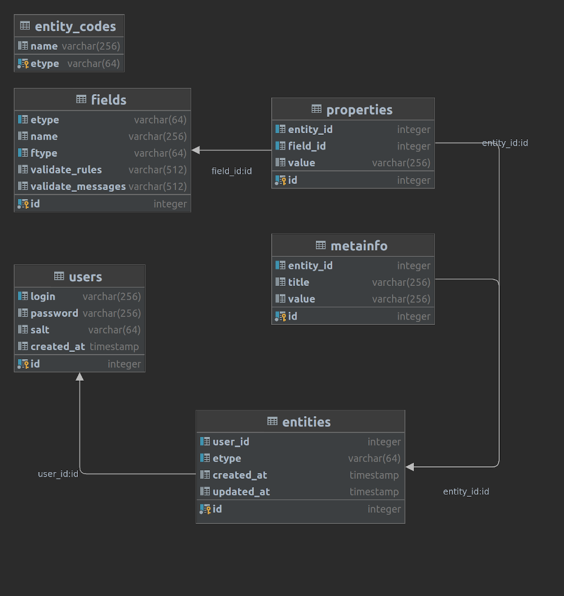

# Описание проекта

## Что используется

- База данных: Postgresql
- Протокол обмена данными между клиентом и сервером: gRPC
- Пакет для работы в консоли: https://github.com/chzyer/readline
- Пакет для валидации вводимых данных - https://github.com/go-playground/validator
- Для тестирования с использованием БД - https://golang.testcontainers.org/ 

## Общее описание
### Хранение данных
Структурированные данные хранятся в базе данных Postgresql. Это данные, обладающие некоторыми свойствами и их значениями. 
Например "банковская карта" имеет номер, дату истечения и CVV код.

Произвольные бинарные и текстовые данные храняться в файлах на диске. В базе данных же хранятся только пути к этим файлам.

### Аутентификация
Аутентификация происходит с помошью JWT токена. 

Токен клиент получает сразу после успешной регистрации - можно сразу приступать к работе. И при успешном входе, после ввода логина и пароля.

Во избежание кражи, токен хранится только в оперативной памяти при работе программы. Также он имеет заданное время "жизни".

При отправке запросов на сервер перехватчик автоматически добавляет токен с ID пользователя к контексту запроса.

Пароль в базе хранится в виде хеша. Для дополнительной криптостойкости при формировании хеша используется "соль"-фрагмент случайных данных.  

### Передача данных
В силу того, что файлы могут иметь большие размеры - их передача происходит в потоковом режиме gRPC. Потоки однонаправленные - от клиента к серверу при сохранении и от сервера к клиенту при получении. Размер чанков/фрагментов задается константой в коде программы.

Обмен происходит по защищенному TLS протоколу. Используются заранее сгенерированные сертификаты. 

### Шифрование
Помимо защищенного канала все критичные данные шифруются симметричным AES алгоритмом.  

Шифровка происходит на стороне клиента, поэтому на сервере все данные зашифрованы, а следовательно потенциальная возможность взлома сервера ничего не даст злоумышленнику.

Ключ шифрования формируется из двух частей. Первая часть - пароль пользователя, вводимый при входе в систему. Вторая часть - секретный ключ (SecretKey), который задается в конфиге. 

При гипотетическом перехвате пароля на стороне сервера злоумышленник не сможет расшифровать данные из-за отсутствия секретного ключа. Заполучив секретный ключ на стороне клиента, злоумышленник также не сможет ничего сделать из-за отсутствия пароля, который в идеале хранится только в голове пользователя!))

Перед отправкой файлы разбиваются на фрагменты и каждый фрагмент шифруется. 

## Хранение файлов
Так как после шифровки получаются фрагменты длиной отличной от изначального размера, а также потому что каждый фрагмент шифруется индивидуально - не получится просто объединить все части в один файл на стороне сервера.

Поэтому для каждого файла на стороне сервера создается отдельная папка со случайным именем и все фрагменты сохраняются туда. Имена файлов содержат префикс в виде порядкового номера фрагмента. А в базе данных хранится путь к папке, базовое имя файлов и количество фрагментов.

## Получение файлов клиентом
В момент запроса файла клиента последовательно считываются все файлы-фрагменты из соответствующей папки и в потоковом режиме передаются на клиент.

На клиенте каждый фрагмент расшифровывается и добавляется к результирующему файлу. После успешного получения файла пользователю сообщается путь к нему.


# Детализация

## Структура базы данных

Идея состояла в том, чтобы данный программный продукт можно было использовать для хранения разных типов данных. Назовем их сущностями. 

То есть мы имеем таблицу с неким набором характеристик для каждой сущности (таблица fields). У каждой сущности есть свой "код", например:
- "card" - это банковская карта
- "logopas" - логин и пароль
- "binary" - файл с бинарными данными
- и т.д.

Расшифровка кодов дается в таблице-справочнике entity_codes

Есть таблица сущностей (entities), где хранится код сущности, код пользователя-владельца и тип сущности.

Есть таблица свойств-сущности (properties), связанная с таблицей сущностей. В таблице свойств хранится код поля-описания, значение свойства и код самой сущности.

Также есть отдельная таблица метаданных (metainfo), связанная с таблицей сущностей. Метаданные имеют название (например "Банк выдавший карту") и значение (например "Сбербанк")

Так как значимыми являются поле значения (value) в таблице свойства и поля title и value в таблице metainfo - то они и шифруются. 



## Структура проекта

### Клиент
cmd/client/ - папка с бинарным исполняемым файлом

cmd/client/cert - самоподписанный корневой сертификат для клиента

cmd/client/filestorage - сюда будут загружаться файлы с сервера

cmd/client/testbinary - пара файлов для тестовых выгрузок-загрузок

internal/client - код клиента

### Сервер
cmd/server/ - папка с бинарным исполняемым файлом

cmd/server/cert - SSL сертификаты

cmd/server/filebank - хранилище файлов

cmd/server/migrations - миграции базы данных

internal/server - код сервера

## Детали реализации

### Валидация вводимых данных
Валидация происходит на стороне клиента. 

Правила же валидации хранятся на стороне сервера для каждого поля в таблице fields. 
Также в этой таблице хранятся сообщения, выдающиеся при возникновении ошибки валидации. 

Таким образом для добавления новой сущности в систему достаточно на стороне сервера указать все ее поля и правила их валидации.

В момент подключения клиент загружает все описания полей доступных сущностей и правил их валидации.

### Ключи запуска клиента
-с - путь к файлу кофигурации

-a - адрес сервера

-k - секретный ключ для AES шифрования

### Ключи запуска сервера
-c - путь к файлу кофигурации

-a - адрес сервера

-d - database DSN

-s - путь к файлу сертификата

-p - путь к файлу приватного ключа


## Что уже реализовано
### Серверная сторона
- аутентификация-регистрация
- добавление сущности 
- отдача списка доступных сущностей для пользователя
- отдача всей информации для конкретной сущности, а также связанных с ней файлов
- тестирование добавления-получения данных (internal/server/handlers/grpc_test.go)

### Сторона клиента
- Собственно сам CLI клиент с регистрацией и аутентификацией, где вводятся данные свойств и указываются пути к файлам для загрузки;
- Соответственно отправка данных на сервер, получение списка сущностей для пользователя, получение данных сущности и связанных с ней файлов;
- Необходимый уровень покрытия тестами

### Интерфейс клиента
На начальном этапе будет предложено ввести логин и пароль для входа в систему. Если же таковые отсутствуют, то можно будет пройти процедуру регистрации. 

После успешной авторизации будет предложен список возможных сущностей, с которыми можно работать.

Управление действиями в клиенте производится путем выбора предложенного варианта действий из пронумерованного списка.

Выбор пункта с номером "0" используется для перехода в начало, к выбору сущности из списка.

Комбинация клавиш Ctrl+C приводит к завершению работы клиента с удалением всех скачанных в течение текущего сеанса файлов. Это сделано во избежание хранения расшифрованных данных между сеансами. Предполагается, что в процессе сеанса пользователь просмотрит всю необходимую информацию или же скопирует ее в надежное место. 

### Протокол взаимодействия клиента и сервера
Документ описывающий protobuf протокол взаимодействия клиента и сервера расположен по пути docs/grpc_doc.html

Этот документ сгенерирован из proto файла с помощью плагина https://github.com/pseudomuto/protoc-gen-doc с использованием готового бинарника командой:

```
protoc \
--plugin=protoc-gen-doc=./protoc-gen-doc \
--doc_out=./docs \
--doc_opt=html,grpc_doc.html \
internal/proto/*.proto
```

### Компиляция
- cmd/client/build.sh - компиляция с добавление данных версии сборки, даты и коммита
- cmd/client/build_mac.sh - компиляция для MacOS
- cmd/client/build_windows.sh - компиляция для Windows

### Прочее
- Покрытие тестами 79.7%. Из покрытия исключены мок файлы и grpc-proto сгененированные файлы. Консольная команда "make cover".


### Возможные проблемы
- При изменении пароля пользователя или секретного ключа расшифровать данные будет невозможно. Поэтому в идеале нужно все данные перешифровывать
- ...

